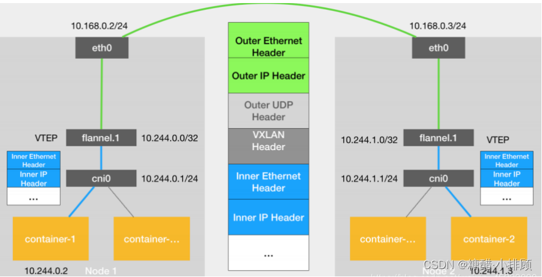

## Docker
#### 1. Docker的相关知识
#####  1.1 Docker 包括三个基本概念
- 镜像（`Image`）：`Docker` 镜像（`Image`），就相当于是一个 `root` 文件系统。比如官方镜像 `ubuntu:16.04` 就包含了完整的一套 `Ubuntu16.04` 最小系统的 `root` 文件系统
- 容器（`Container`）：镜像（`Image`）和容器（`Container`）的关系，就像是面向对象程序设计中的类和实例一样，镜像是静态的定义，容器是镜像运行时的实体。容器可以被创建、启动、停止、删除、暂停等。
- 仓库（Repository）：仓库可看成一个代码控制中心，用来保存镜像

##### 1.2 Docker 和 Docker-compose 的安装和卸载
- Docker 和 Docker-compose 的安装
    ```shell
    #/bin/bash
    # -*- coding:utf-8 -*-
    # @Description: 
    # docker yum源安装
    # linux 版本: Centos7.8-x86_x64

    # 安装docker依赖
    yum -y install gcc pcre pcre-devel zlib zlib-devel openssl openssl-devel wget vim  net-tools

    # 下载 docker yum源
    wget -O /etc/yum.repos.d/docker-ce.repo \
    https://repo.huaweicloud.com/docker-ce/linux/centos/docker-ce.repo

    # 软件仓库地址替换
    sudo sed -i 's+download.docker.com+repo.huaweicloud.com/docker-ce+' /etc/yum.repos.d/docker-ce.repo

    # 搜索docker的版本
    # yum list docker-ce.x86_64 --showduplicates | sort -r

    # 更新索引文件并安装
    yum clean all && yum makecache fast 
    yum install -y docker-ce-20.10.17-3.el7

    # docker 镜像加速器
    mkdir -p /etc/docker
    touch /etc/docker/daemon.json
    cat  <<EOF > /etc/docker/daemon.json
    {
        "registry-mirrors": ["https://c97caf8c351147e9af186e854bb87384.mirror.swr.myhuaweicloud.com"]
    }
    EOF
            
    # 配置完成后，重启容器引擎
    systemctl daemon-reload  # 重新加载配置文件
    systemctl restart docker 
    # 开机自启动
    systemctl enable docker 

    # 安装docker-compose
    # 下载文件(由于是外网可能下载不下来)
    # sudo curl -L https://github.com/docker/compose/releases/download/v2.6.1/docker-compose-linux-x86_64 > /usr/local/bin/docker-compose
    read -p "把下载好的docker-compose文件放在/root下面, 请自行检查!!!" ssss
    mv /root/docker-compose-linux-x86_64 /usr/local/bin/docker-compose

    # 修改权限
    sudo chmod 755 /usr/local/bin/docker-compose
    # 创建软连接
    sudo ln -s /usr/local/bin/docker-compose /usr/bin/docker-compose

    echo ""
    docker -v
    docker-compose --version
    echo -e "\033[32mSuccess: Docker 安装成功 (^_^)\033[0m"
    echo -e "\033[32mSuccess: Docker-compose 安装成功 (^_^)\033[0m"
    echo ""
    ```

- Docker 和 Docker-compose 的卸载
    ```shell
    #/bin/bash
    # -*- coding:utf-8 -*-
    # @Description: 
    # docker卸载
    # linux 版本: Centos7.8-x86_x64

    # 停止docker服务
    systemctl stop docker

    # 卸载 Docker 引擎
    yum remove -y docker-ce docker-ce-cli containerd.io

    # 要删除所有映像、容器和卷
    rm -rf /var/lib/docker /var/lib/containerd

    # 卸载docker镜像加速配置文件
    rm -rf  /etc/docker/daemon.json
            
    # 删除docker-compose
    rm -rf /usr/local/bin/docker-compose /usr/bin/docker-compose

    echo ""
    echo -e "\033[32mSuccess: Docker 卸载成功 (^_^)\033[0m"
    echo -e "\033[32mSuccess: Docker-compose 卸载成功 (^_^)\033[0m"
    echo ""
    
    ```

##### 1.4 Docker
- docker 常用指令
    ```shell
    # 官方镜像库地址：https://hub.docker.com
    # 查看本地镜像, docker的版本, docker的配置信息
    docker images
    docker version
    docker info

    # 拉取`Centos7.8`镜像
    docker pull centos:centos7.8.2003

    # docker run 启动的通用格式
    docker run -itd # 后台运行
    --rm \  # 存在相同的容器就删除
    --restart always \ # 容器退出后总是重启
    --name string \  # 容器的名字
    --net mynet \  # 特定的网络, 可以用现有的,也可以用docker network创建
    -h nginx-test \  # 容器内主机名
    -e PASSWORD=1234 -e USERNAME=wangxi \   # 环境变量
    -w /root/test \  # 容器一开始进入的工作目录
    -P 80 \ 容器内的端口随机映射到宿主机端口
    -p 8080:80 -p 127.0.0.1:8888:90 \  # 端口映射
    -v /root/test:/var/test -v /root/log:/var/log \ # 挂载卷
    --link <name or id>:alias \  # 连接其他容器, 决定创建容器的顺序
    python:3.9 \ # 容器镜像的名字或者id
    sh -c 'exec echo "hello"' \ # 进入容器的指令

    # 用命令进入一个正在运行的容器终端
    docker exec -it 容器ID /bin/bash

    # 查看容器的运行信息
    docker ps -a

    # 查看容器的运行占用系统资源
    docker stats

    # 停止容器的运行
    docker stop 容器ID

    # 删除容器:
    docker rm 容器ID

    # 删除所有的容器应用的shell指令
    docker rm -f $(docker ps -qa); docker ps -a

    # 删除所有的容器镜像的shell指令
    docker rmi $(docker images -qa); docker images

    # 创建network
    docker network create --driver mynet --subnet 192.168.143.0/16 --gatework 192.168.0.1

    # 卷的操作, 查看卷
    docker volume ls

    ```
- 镜像的拉取与上传:
    ```shell
    # 用户临时登录
    docker login -u cn-north-4@9O8ZVEXC4EUJXHQ1JJSR -p \
    0f5bdc1943cc507204fbc121f69fbb888f8f1b458411910ee3069332cfa9b12a swr.cn-north-4.myhuaweicloud.com

    # 拉取镜像
    docker pull swr.cn-north-7.myhuaweicloud.com/paas_ief_a00397635_01/nginx:{版本名称}

    # 查看镜像
    docker images

    # 镜像打标签
    docker tag nginx:{版本名称} swr.cn-north-4.myhuaweicloud.com/wx-2022/nginx:{版本名称}

    # 上传镜像
    docker push swr.cn-north-4.myhuaweicloud.com/wx-2022/nginx:{版本名称}

    # 打包镜像
    docker save nginx:latest > nginx.tar.gz

    # 导入镜像文件
    docker load < 路径/文件名.tar
    ```

- Dockerfile 的语法
    ```shell
    # 基础镜像
    FROM 镜像名称

    # 只有在构建镜像的时候才会执行, docker build
    # RUN 命令尽量写成一行, 只产生一层镜像
    RUN shell指令
    # 运行多行命令
    RUN apk update; \
        apk add git; \
        sleep 10s;

    # 只有在启动镜像的时候才会执行, docker run
    # CMD 指令指定的程序可被 docker run 命令行参数中指定要运行的程序所覆盖
    # 如果 Dockerfile 中如果存在多个 CMD 指令，仅最后一个生效, 是为 ENTRYPOINT 指令指定的程序提供默认参数
    CMD shell指令
    CMD ["<可执行文件或命令>","<param1>","<param2>",...] # 推荐写法
    CMD ["<param1>","<param2>",...] 

    # 类似于 CMD 指令，但其不会被 docker run 的命令行参数指定的指令所覆盖，而且这些命令行参数会被当作参数送给 ENTRYPOINT 指令指定的程序
    # 如果运行 docker run 时使用了 --entrypoint 选项，将覆盖 ENTRYPOINT 指令指定的程序
    # 在执行 docker run 的时候可以指定 ENTRYPOINT 运行所需的参数
    # 如果 Dockerfile 中如果存在多个 ENTRYPOINT 指令，仅最后一个生效
    ENTRYPOINT ["<executeable>","<param1>","<param2>",...]

    # 类似于 cp 指令(支持 "." ), 不会解压压缩包
    COPY 源文件 目标文件

    # 类似于 COPY 指令, 会自动解压压缩包
    ADD 源文件 目标文件

    # 环境变量, 使用$key1引用
    ENV <key1>=<value1> <key2>=<value2>...

    # 只有在dockerfile中可用
    ARG <参数名>[=<默认值>]

    # 匿名数据卷, 目录不存在, 容器内外都会自动创建.
    VOLUME ["<路径1>", "<路径2>"...]

    # 声明端口, 类似于 docker run -P
    EXPOSE <端口1> [<端口2>...]

    # 工作目录
    WORKDIR <工作目录路径>

    # 执行后续命令的用户和用户组
    USER <用户名>[:<用户组>]

    # LABEL 指令用来给镜像添加一些元数据（metadata），以键值对的形式
    LABEL <key>=<value> <key>=<value> <key>=<value> ...
    ```

##### 1.5 Nginx镜像
- 官方nginx镜像
    ```shell
    # docker拉取 nginx 的指令
    docker pull nginx:1.22

    # 运行容器
    docker run --name nginx-test -p 8080:80 -d nginx:1.22

    # 进入容器
    docker exec -it nginx-test /bin/bash

    # 容器内部配置
    # 默认端口号: 80, 443
    # 网页文件默认目录: /usr/share/nginx/html
    # 配置文件的目录: /etc/nginx/conf.d
    # 日志目录: /var/log/nginx/
    ```

- Nginx镜像配置
    ```shell
    # nginx 的通配符 
    # = 表示精确匹配
    # ^~ 表示普通字符匹配, 即前缀匹配。如果匹配成功，则不再匹配其他 location
    # ~ 正则匹配(区分大小写)
    # ~* 正则匹配(不区分大小写)
    # !~ 和 !~* 分别为区分大小写不匹配及不区分大小写不匹配 的正则
    # 匹配顺序: (location = 完整路径) > (location ^~ 完整路径) > (location ~* 完整路径) 
    # >(location ~ 完整路径) > (location /)通用匹配

    # rewrite 重写规则: 常用于代理转发中
    # 开启重写: set $rewrite true; 
    # rewrite <regex> <replacement> [flag];
    # regex：表示正则匹配规则
    # replacement：表示跳转后的内容
    # flag：表示rewrite 支持的 flag 标记
    # 示例: 
    # location / {
    #     # $host为Rewrite全局变量，代表请求主机头字段或主机名
    #         if ($host = 'www.kgc.com'){   
    #         # $1为正则匹配内容，即域名/后之后的字符串
    #         rewrite ^/(.*)$ http://www.benet.com/$1 permanent;
    #     }
    #     root   html;
    #     index  index.html index.htm;
    # }
    #
    # flag 标记说明：
    # last：本条规则匹配完成后，继续向下匹配新的location URL规则，一般用在server和if中
    # break：本条规则匹配完成即终止，不再匹配后面的任何规则。一般用在location中
    # redirect：返回 302 临时重定向，浏览器地址会显示跳转后的 URL 地址，爬虫不会更新 url（因为是临时）。
    # permanent：返回 301 永久重定向，浏览器地址栏会显示跳转后的 URL 地址，爬虫更新 url。

    # 预置变量
    # $remote_addr: 存放了'客户端的地址',注意是客户端的公网IP,也就是一家人访问一个网站,则会显示为'路由器的公网IP'
    # $args: 变量中存放了'请求行中(GET请求)的参数' 
    # $host: 存放了'请求的host名称'
    # $http_user_agent: '客户端浏览器'的详细信息
    # $http_cookie: '客户端的cookie'信息
    # $remote_port: 客户端请求Nginx服务器时'随机打开的端口',这是每个'客户端自己的端口'
    # $remote_user: 已经'经过Auth Basic Module验证'的用户名
    # $request_method: 请求'资源的方式',GET、PUT、DELETE等
    # $request_filename: 当前'请求的资源文件的路径'名称，如：/apps/nginx/html/main/index.html
    # $request_url: 包含'请求参数'的原始url,'不包含主机名'，如：/main/index.do?id=20190221&partner=search 
    # $scheme: 请求的'协议',如ftp、https、http等
    # $server_protocol: 保存了'客户端请求资源'使用的协议的版,如HTTP/1.0、'HTTP/1.1'、HTTP/2.0等
    # $server_addr: 保存了'服务器的IP地址'
    # $server_name: 请求的'服务器的主机名'
    # $server_port: 请求的'服务器的端口号'

    # 日志格式
    # log_format  main  
    # $remote_addr - $remote_user [$time_local] $request $status $body_bytes_sent $http_referer
    # $http_user_agent $http_x_forwarded_for;

    # nginx 实现负载均衡的常用策略
    # a.轮询（默认): 客户端发出的每个请求将按照时间顺序逐一分配到不同的后端服务器，如后端服务器down掉，能自动剔除。
    upstream backserver {
        server 192.168.1.10;
        server 192.168.1.11;
    }
    # b.weight:代表权重，默认为1，weight的数值越小，代表权重越小，分配到的流量越少
    upstream backserver {
        server 192.168.1.10 weight=3;
        server 192.168.1.11 weight=7;
    }
    ```

- nginx.conf使用模板
    ```shell
    user  nginx;
    worker_processes  auto;

    error_log  /var/log/nginx/error.log notice;
    pid        /var/run/nginx.pid;

    events {
        worker_connections  1024;
    }

    http {
        include       /etc/nginx/mime.types;
        default_type  application/octet-stream;

        # 负载均衡设置
        # 其他 *.conf 文件中引入服务器名: myserver 进行代理转发
        upstream myserver {
            server 127.0.0.1:8081;
            server 127.0.0.1:8082;
        }
        log_format  main  '$remote_addr - $remote_user [$time_local] "$request" '
                        '$status $body_bytes_sent "$http_referer" '
                        '"$http_user_agent" "$http_x_forwarded_for"';

        access_log  /var/log/nginx/access.log  main;
        sendfile        on;
        #tcp_nopush     on;
        keepalive_timeout  65;
        #gzip  on;

        # 自定义配置文件: *.conf, 以下是示例:
        server {
            listen       80;
            server_name  my-demo002;

            access_log  /var/log/nginx/my-demo002.access.log;

            location / {
                # 引入服务器名: myserver 进行代理转发
                # proxy_pass   http://myserver;  

                root   /apps/my-demo002;
                index  index.html index.htm;
            }

            #error_page  404              /404.html;

            # redirect server error pages to the static page /50x.html
            #
            error_page   500 502 503 504  /50x.html;
            location = /50x.html {
                root   /usr/share/nginx/html;
            }

            # proxy the PHP scripts to Apache listening on 127.0.0.1:80
            #
            #location ~ \.php$ {
            #    proxy_pass   http://127.0.0.1;
            #}

            # API 接口调用 
            # 请求路径为：http://127.0.0.1:80/api/getUser   
            # 实际代理为：http://127.0.0.1:8080/getUser
            location ^~ /api/ {
                proxy_pass http://127.0.0.1:8080/;
                #后台可以获取到用户访问的真实ip地址
                proxy_set_header X-Real-IP $remote_addr; 
                #后台可以获取到请求服务器完整的ip地址
                proxy_set_header Host $http_host; 
            }

            # pass the PHP scripts to FastCGI server listening on 127.0.0.1:9000
            #
            #location ~ \.php$ {
            #    fastcgi_pass   127.0.0.1:9000;
            #    fastcgi_index  index.php;
            #    fastcgi_param  SCRIPT_FILENAME  /scripts$fastcgi_script_name;
            #    include        fastcgi_params;
            #}

            # deny access to .htaccess files, if Apache's document root
            # concurs with nginx's one
            #
            #location ~ /\.ht {
            #    deny  all;
            #}
        }

        # HTTPS server
        #
        #server {
        #    listen       443 ssl;
        #    server_name  localhost;

        #    ssl_certificate      cert.pem;
        #    ssl_certificate_key  cert.key;

        #    ssl_session_cache    shared:SSL:1m;
        #    ssl_session_timeout  5m;

        #    ssl_ciphers  HIGH:!aNULL:!MD5;
        #    ssl_prefer_server_ciphers  on;

        #    location / {
        #        root   /usr/share/nginx/html;
        #        index  index.html index.htm;
        #    }
        #}

        # 加入其他的配置文件
        include /etc/nginx/conf.d/*.conf;
    }
    ```
- nginx官方镜像配置文件: nginx.conf
    ```shell
    user  nginx;
    worker_processes  auto;

    error_log  /var/log/nginx/error.log notice;
    pid        /var/run/nginx.pid;


    events {
        worker_connections  1024;
    }

    http {
        include       /etc/nginx/mime.types;
        default_type  application/octet-stream;

        log_format  main  '$remote_addr - $remote_user [$time_local] "$request" '
                          '$status $body_bytes_sent "$http_referer" '
                          '"$http_user_agent" "$http_x_forwarded_for"';

        access_log  /var/log/nginx/access.log  main;
        sendfile        on;
        #tcp_nopush     on;
        keepalive_timeout  65;
        #gzip  on;
        include /etc/nginx/conf.d/*.conf;
    }
    ```

- 官方nginx镜像: default.conf
    ```shell
    server {
        listen       80;
        server_name  localhost;

        location / {
            root   /usr/share/nginx/html;
            index  index.html index.htm index.php;
        }

        error_page   500 502 503 504  /50x.html;
        location = /50x.html {
            root   /usr/share/nginx/html;
        }
        access_log  /var/log/nginx/default.log;
        error_log  /var/log/nginx/default.error.log;
    }
    ```

- 宝塔nginx配置文件: nginx.conf
    ```shell
    user  www www;
    worker_processes auto;
    error_log  /www/wwwlogs/nginx_error.log  crit;
    pid        /www/server/nginx/logs/nginx.pid;
    worker_rlimit_nofile 51200;

    events
        {
            use epoll;
            worker_connections 51200;
            multi_accept on;
        }

    http
        {
            include       mime.types;
            #include luawaf.conf;
            include proxy.conf;

            default_type  application/octet-stream;

            server_names_hash_bucket_size 512;
            client_header_buffer_size 32k;
            large_client_header_buffers 4 32k;
            client_max_body_size 50m;

            sendfile   on;
            tcp_nopush on;

            keepalive_timeout 60;

            tcp_nodelay on;

            fastcgi_connect_timeout 300;
            fastcgi_send_timeout 300;
            fastcgi_read_timeout 300;
            fastcgi_buffer_size 64k;
            fastcgi_buffers 4 64k;
            fastcgi_busy_buffers_size 128k;
            fastcgi_temp_file_write_size 256k;
            fastcgi_intercept_errors on;

            gzip on;
            gzip_min_length  1k;
            gzip_buffers     4 16k;
            gzip_http_version 1.1;
            gzip_comp_level 2;
            gzip_types     text/plain application/javascript application/x-javascript text/javascript text/css application/xml;
            gzip_vary on;
            gzip_proxied   expired no-cache no-store private auth;
            gzip_disable   "MSIE [1-6]\.";

            limit_conn_zone $binary_remote_addr zone=perip:10m;
            limit_conn_zone $server_name zone=perserver:10m;

            server_tokens off;
            access_log off;

        server
        {
            listen 888;
            server_name phpmyadmin;
            index index.html index.htm index.php;
            root  /www/server/phpmyadmin;
            location ~ /tmp/ {
                    return 403;
                }

            #error_page   404   /404.html;
            include enable-php.conf;

            location ~ .*\.(gif|jpg|jpeg|png|bmp|swf)$
            {
                expires      30d;
            }

            location ~ .*\.(js|css)?$
            {
                expires      12h;
            }

            location ~ /\.
            {
                deny all;
            }

            access_log  /www/wwwlogs/access.log;
        }
        include /www/server/panel/vhost/nginx/*.conf;
    }
    ```

- 宝塔nginx配置文件: default.conf
    ```shell
    server
    {
        listen 80;
        server_name www.huohuoren4.xyz;
        index index.php index.html index.htm default.php default.htm default.html;
        root /www/wwwroot/www.huohuoren4.xyz;

        #SSL-START SSL相关配置，请勿删除或修改下一行带注释的404规则
        #error_page 404/404.html;
        #SSL-END

        #ERROR-PAGE-START  错误页配置，可以注释、删除或修改
        #error_page 404 /404.html;
        #error_page 502 /502.html;
        #ERROR-PAGE-END

        #PHP-INFO-START  PHP引用配置，可以注释或修改
        include enable-php-74.conf;
        #PHP-INFO-END

        #REWRITE-START URL重写规则引用,修改后将导致面板设置的伪静态规则失效
        include /www/server/panel/vhost/rewrite/www.huohuoren4.xyz.conf;
        #REWRITE-END

        #禁止访问的文件或目录
        location ~ ^/(\.user.ini|\.htaccess|\.git|\.svn|\.project|LICENSE|README.md)
        {
            return 404;
        }

        #一键申请SSL证书验证目录相关设置
        location ~ \.well-known{
            allow all;
        }

        #禁止在证书验证目录放入敏感文件
        if ( $uri ~ "^/\.well-known/.*\.(php|jsp|py|js|css|lua|ts|go|zip|tar\.gz|rar|7z|sql|bak)$" ) {
            return 403;
        }

        location ~ .*\.(gif|jpg|jpeg|png|bmp|swf)$
        {
            expires      30d;
            error_log /dev/null;
            access_log /dev/null;
        }

        location ~ .*\.(js|css)?$
        {
            expires      12h;
            error_log /dev/null;
            access_log /dev/null;
        }
        access_log  /www/wwwlogs/www.huohuoren4.xyz.log;
        error_log  /www/wwwlogs/www.huohuoren4.xyz.error.log;
    }
    ```

##### 1.6 Mysql 镜像
- mysql5.7官方镜像
    ```shell
    # docker拉取 mysql 的指令
    docker pull mysql:5.7

    # 运行容器
    docker run -itd --name mysql-test -p 3306:3306 -e MYSQL_ROOT_PASSWORD=123456 mysql:5.7

    # 进入容器
    docker exec -it mysql-test /bin/bash

    # 容器内部配置
    # 端口号: 3306
    # MYSQL_ROOT_PASSWORD=123456
    # 配置文件夹: /etc/mysql/conf.d
    # 上面目录下有三个配置文件: docker.cnf  mysql.cnf  mysqldump.cnf
    # pid-file        = /var/run/mysqld/mysqld.pid
    # socket          = /var/run/mysqld/mysqld.sock
    # datadir         = /var/lib/mysql
    # log-error      = /var/log/mysql/error.log

    # 备份数据库
    docker exec some-mysql sh -c 'exec mysqldump --all-databases -uroot -p"$MYSQL_ROOT_PASSWORD"' > /root/all-databases.sql

    # 导入数据
    docker exec -i some-mysql sh -c 'exec mysql -uroot -p"$MYSQL_ROOT_PASSWORD"' < /root/all-databases.sql
    ```

- mysql配置文件详细配置
    ```shell
    [client]
    port = 3306
    socket = /tmp/mysql.sock
    [mysqld]
    ###############################基础设置#####################################
    #Mysql服务的唯一编号 每个mysql服务Id需唯一
    server-id = 1
    #服务端口号 默认3306
    port = 3306
    #mysql安装根目录
    basedir = /opt/mysql
    #mysql数据文件所在位置
    datadir = /opt/mysql/data
    #临时目录 比如load data infile会用到
    tmpdir  = /tmp
    #设置socke文件所在目录
    socket  = /tmp/mysql.sock
    #主要用于MyISAM存储引擎,如果多台服务器连接一个数据库则建议注释下面内容
    skip-external-locking
    #只能用IP地址检查客户端的登录，不用主机名
    skip_name_resolve = 1
    #事务隔离级别，默认为可重复读，mysql默认可重复读级别（此级别下可能参数很多间隙锁，影响性能）
    transaction_isolation = READ-COMMITTED
    #数据库默认字符集,主流字符集支持一些特殊表情符号（特殊表情符占用4个字节）
    character-set-server = utf8mb4
    #数据库字符集对应一些排序等规则，注意要和character-set-server对应
    collation-server = utf8mb4_general_ci
    #设置client连接mysql时的字符集,防止乱码
    init_connect='SET NAMES utf8mb4'
    #是否对sql语句大小写敏感，1表示不敏感
    lower_case_table_names = 1
    #最大连接数
    max_connections = 400
    #最大错误连接数
    max_connect_errors = 1000
    #TIMESTAMP如果没有显示声明NOT NULL，允许NULL值
    explicit_defaults_for_timestamp = true
    #SQL数据包发送的大小，如果有BLOB对象建议修改成1G
    max_allowed_packet = 128M
    #MySQL连接闲置超过一定时间后(单位：秒)将会被强行关闭
    #MySQL默认的wait_timeout  值为8个小时, interactive_timeout参数需要同时配置才能生效
    interactive_timeout = 1800
    wait_timeout = 1800
    #内部内存临时表的最大值 ，设置成128M。
    #比如大数据量的group by ,order by时可能用到临时表，
    #超过了这个值将写入磁盘，系统IO压力增大
    tmp_table_size = 134217728
    max_heap_table_size = 134217728
    #禁用mysql的缓存查询结果集功能
    #后期根据业务情况测试决定是否开启
    #大部分情况下关闭下面两项
    query_cache_size = 0
    query_cache_type = 0

    ##----------------------------用户进程分配到的内存设置BEGIN-----------------------------##

    ##每个session将会分配参数设置的内存大小
    #用于表的顺序扫描，读出的数据暂存于read_buffer_size中，当buff满时或读完，将数据返回上层调用者
    #一般在128kb ~ 256kb,用于MyISAM
    #read_buffer_size = 131072

    #用于表的随机读取，当按照一个非索引字段排序读取时会用到，
    #一般在128kb ~ 256kb,用于MyISAM
    #read_rnd_buffer_size = 262144

    #order by或group by时用到
    #建议先调整为2M，后期观察调整
    sort_buffer_size = 2097152

    #一般数据库中没什么大的事务，设成1~2M，默认32kb
    binlog_cache_size = 524288

    ##---------------------------用户进程分配到的内存设置END-------------------------------##

    #在MySQL暂时停止响应新请求之前的短时间内多少个请求可以被存在堆栈中
    #官方建议back_log = 50 + (max_connections / 5),封顶数为900
    back_log = 130

    ############################日  志 设置##########################################

    #数据库错误日志文件
    log_error = error.log

    #慢查询sql日志设置
    slow_query_log = 1
    slow_query_log_file = slow.log

    #检查未使用到索引的sql
    log_queries_not_using_indexes = 1

    #针对log_queries_not_using_indexes开启后，记录慢sql的频次、每分钟记录的条数
    log_throttle_queries_not_using_indexes = 5

    #作为从库时生效,从库复制中如何有慢sql也将被记录
    log_slow_slave_statements = 1

    #慢查询执行的秒数，必须达到此值可被记录
    long_query_time = 8

    #检索的行数必须达到此值才可被记为慢查询
    min_examined_row_limit = 100

    #mysql binlog日志文件保存的过期时间，过期后自动删除
    expire_logs_days = 5

    ############################主从复制 设置########################################

    #开启mysql binlog功能
    log-bin=mysql-bin

    #binlog记录内容的方式，记录被操作的每一行
    binlog_format = ROW

    #对于binlog_format = ROW模式时，减少记录日志的内容，只记录受影响的列
    binlog_row_image = minimal

    #master status and connection information输出到表mysql.slave_master_info中
    master_info_repository = TABLE

    #the slave's position in the relay logs输出到表mysql.slave_relay_log_info中
    relay_log_info_repository = TABLE

    #作为从库时生效,想进行级联复制，则需要此参数
    log_slave_updates

    #作为从库时生效,中继日志relay-log可以自我修复
    relay_log_recovery = 1

    #作为从库时生效,主从复制时忽略的错误
    slave_skip_errors = ddl_exist_errors

    ##---redo log和binlog的关系设置BEGIN---##

    #(步骤1) prepare dml相关的SQL操作，然后将redo log buff中的缓存持久化到磁盘
    #(步骤2)如果前面prepare成功，那么再继续将事务日志持久化到binlog
    #(步骤3)如果前面成功，那么在redo log里面写上一个commit记录

    #当innodb_flush_log_at_trx_commit和sync_binlog都为1时是最安全的，
    #在mysqld服务崩溃或者服务器主机crash的情况下，binary log只有可能丢失最多一个语句或者一个事务。
    #但是都设置为1时会导致频繁的io操作，因此该模式也是最慢的一种方式。

    #当innodb_flush_log_at_trx_commit设置为0，mysqld进程的崩溃会导致上一秒钟所有事务数据的丢失。
    #当innodb_flush_log_at_trx_commit设置为2，只有在操作系统崩溃或者系统掉电的情况下，上一秒钟所有事务数据才可能丢失。

    #commit事务时,控制redo log buff持久化磁盘的模式 默认为1
    innodb_flush_log_at_trx_commit = 2

    #commit事务时,控制写入mysql binlog日志的模式 默认为 0
    #innodb_flush_log_at_trx_commit和sync_binlog都为1时，mysql最为安全但性能上压力也是最大
    sync_binlog = 1

    ##---redo log 和 binlog的关系设置END---##

    ############################Innodb设置##########################################

    #数据块的单位8k，默认是16k，16kCPU压力稍小，8k对select的吞吐量大
    #innodb_page_size的参数值也影响最大索引长度，8k比16k的最大索引长度小
    #innodb_page_size = 8192

    #一般设置物理存储的60% ~ 70%
    innodb_buffer_pool_size = 1G

    #5.7.6之后默认16M
    #innodb_log_buffer_size = 16777216
    #该参数针对unix、linux，window上直接注释该参数.默认值为NULL

    #O_DIRECT减少操作系统级别VFS的缓存和Innodb本身的buffer缓存之间的冲突
    innodb_flush_method = O_DIRECT

    #此格式支持压缩, 5.7.7之后为默认值
    innodb_file_format = Barracuda

    #CPU多核处理能力设置，假设CPU是2颗4核的，设置如下
    #读多，写少可以设成2:6的比例
    innodb_write_io_threads = 4
    innodb_read_io_threads = 4

    #提高刷新脏页数量和合并插入数量，改善磁盘I/O处理能力
    #默认值200（单位：页）
    #可根据磁盘近期的IOPS确定该值
    innodb_io_capacity = 500

    #为了获取被锁定的资源最大等待时间，默认50秒，超过该时间会报如下错误:
    # ERROR 1205 (HY000): Lock wait timeout exceeded; try restarting transaction
    innodb_lock_wait_timeout = 30

    #调整buffer pool中最近使用的页读取并dump的百分比,通过设置该参数可以减少转储的page数
    innodb_buffer_pool_dump_pct = 40

    #设置redoLog文件所在目录, redoLog记录事务具体操作内容
    innodb_log_group_home_dir = /opt/mysql/redolog/

    #设置undoLog文件所在目录, undoLog用于事务回滚操作
    innodb_undo_directory = /opt/mysql/undolog/

    #在innodb_log_group_home_dir中的redoLog文件数, redoLog文件内容是循环覆盖写入。
    innodb_log_files_in_group = 3

    #MySql5.7官方建议尽量设置的大些，可以接近innodb_buffer_pool_size的大小
    #之前设置该值较大时可能导致mysql宕机恢复时间过长，现在恢复已经加快很多了
    #该值减少脏数据刷新到磁盘的频次
    #最大值innodb_log_file_size * innodb_log_files_in_group <= 512GB,单文件<=256GB
    innodb_log_file_size = 1024M

    #设置undoLog文件所占空间可以回收
    #5.7之前的MySql的undoLog文件一直增大无法回收
    innodb_undo_log_truncate = 1
    innodb_undo_tablespaces = 3
    innodb_undo_logs = 128

    #5.7.7默认开启该参数 控制单列索引长度最大达到3072
    #innodb_large_prefix = 1

    #5.7.8默认为4个, Inodb后台清理工作的线程数
    #innodb_purge_threads = 4

    #通过设置配置参数innodb_thread_concurrency来限制并发线程的数量，
    #一旦执行线程的数量达到这个限制，额外的线程在被放置到对队列中之前，会睡眠数微秒，
    #可以通过设定参数innodb_thread_sleep_delay来配置睡眠时间
    #该值默认为0,在官方doc上，对于innodb_thread_concurrency的使用，也给出了一些建议:
    #(1)如果一个工作负载中，并发用户线程的数量小于64，建议设置innodb_thread_concurrency=0；
    #(2)如果工作负载一直较为严重甚至偶尔达到顶峰，建议先设置innodb_thread_concurrency=128,
    ###并通过不断的降低这个参数，96, 80, 64等等，直到发现能够提供最佳性能的线程数
    #innodb_thread_concurrency = 0

    #强所有发生的死锁错误信息记录到error.log中，之前通过命令行只能查看最近一次死锁信息
    innodb_print_all_deadlocks = 1

    ############################其他内容 设置##########################################

    [mysqldump]
    quick
    max_allowed_packet = 128M

    [mysql]
    no-auto-rehash

    [myisamchk]
    key_buffer_size = 20M
    sort_buffer_size = 256k
    read_buffer = 2M
    write_buffer = 2M

    [mysqlhotcopy]
    interactive-timeout

    [mysqld_safe]
    #增加每个进程的可打开文件数量.
    open-files-limit = 28192
    ```

- 宝塔mysql配置文件:
    ```shell
    [client]
    #password	= your_password
    port		= 3306
    socket		= /tmp/mysql.sock

    [mysqld]
    port		= 3306
    socket		= /tmp/mysql.sock
    datadir = /www/server/data
    default_storage_engine = InnoDB
    performance_schema_max_table_instances = 400
    table_definition_cache = 400
    skip-external-locking
    key_buffer_size = 32M
    max_allowed_packet = 100G
    table_open_cache = 128
    sort_buffer_size = 768K
    net_buffer_length = 4K
    read_buffer_size = 768K
    read_rnd_buffer_size = 256K
    myisam_sort_buffer_size = 8M
    thread_cache_size = 16
    query_cache_size = 16M
    tmp_table_size = 32M
    sql-mode=NO_ENGINE_SUBSTITUTION,STRICT_TRANS_TABLES

    explicit_defaults_for_timestamp = true
    #skip-name-resolve
    max_connections = 500
    max_connect_errors = 100
    open_files_limit = 65535

    log-bin=mysql-bin
    binlog_format=mixed
    server-id = 1
    expire_logs_days = 10
    # 慢查询开关
    slow_query_log=1
    # 慢查询日志文件
    slow-query-log-file=/www/server/data/mysql-slow.log
    # 慢查询时间设置
    long_query_time=3
    # 未使用索引的语句也记录到慢查询日志
    #log_queries_not_using_indexes=on
    early-plugin-load = ""

    innodb_data_home_dir = /www/server/data
    innodb_data_file_path = ibdata1:10M:autoextend
    innodb_log_group_home_dir = /www/server/data
    innodb_buffer_pool_size = 128M
    innodb_log_file_size = 64M
    innodb_log_buffer_size = 16M
    innodb_flush_log_at_trx_commit = 1
    innodb_lock_wait_timeout = 50
    innodb_max_dirty_pages_pct = 90
    innodb_read_io_threads = 1
    innodb_write_io_threads = 1

    [mysqldump]
    quick
    max_allowed_packet = 500M

    [mysql]
    no-auto-rehash

    [myisamchk]
    key_buffer_size = 32M
    sort_buffer_size = 768K
    read_buffer = 2M
    write_buffer = 2M

    [mysqlhotcopy]
    interactive-timeout
    ```

- 自定义mysql配置: my.cnf
    ```shell
    [client]
    #password	= your_password
    port		= 3306
    socket		= /var/run/mysqld/mysqld.sock

    [mysqld]
    port		= 3306
    # 在容器`/etc/mysql/mysql.conf.d/mysqld.cnf`中已经设置
    # pid-file        = /var/run/mysqld/mysqld.pid
    # socket          = /var/run/mysqld/mysqld.sock
    # datadir         = /var/lib/mysql
    # log-error      = /var/log/mysql/error.log
    default_storage_engine = InnoDB
    performance_schema_max_table_instances = 400
    table_definition_cache = 400
    skip-external-locking
    key_buffer_size = 32M
    max_allowed_packet = 100G
    table_open_cache = 128
    sort_buffer_size = 768K
    net_buffer_length = 4K
    read_buffer_size = 768K
    read_rnd_buffer_size = 256K
    myisam_sort_buffer_size = 8M
    thread_cache_size = 16
    query_cache_size = 16M
    tmp_table_size = 32M
    sql-mode=NO_ENGINE_SUBSTITUTION,STRICT_TRANS_TABLES

    explicit_defaults_for_timestamp = true
    #skip-name-resolve
    max_connections = 500
    max_connect_errors = 100
    open_files_limit = 65535

    log-bin=mysql-bin
    binlog_format=mixed
    server-id = 1
    expire_logs_days = 10
    # 慢查询开关
    slow_query_log=1
    # 慢查询日志文件
    slow-query-log-file=/var/log/mysql/mysql-slow.log
    # 慢查询时间设置
    long_query_time=3
    # 未使用索引的语句也记录到慢查询日志
    #log_queries_not_using_indexes=on
    early-plugin-load = ""

    innodb_data_home_dir = /var/lib/mysql
    innodb_data_file_path = ibdata1:10M:autoextend
    innodb_log_group_home_dir = /var/lib/mysql
    innodb_buffer_pool_size = 128M
    innodb_log_file_size = 64M
    innodb_log_buffer_size = 16M
    innodb_flush_log_at_trx_commit = 1
    innodb_lock_wait_timeout = 50
    innodb_max_dirty_pages_pct = 90
    innodb_read_io_threads = 1
    innodb_write_io_threads = 1

    [mysqldump]
    quick
    max_allowed_packet = 500M

    [mysql]
    no-auto-rehash

    [myisamchk]
    key_buffer_size = 32M
    sort_buffer_size = 768K
    read_buffer = 2M
    write_buffer = 2M

    [mysqlhotcopy]
    interactive-timeout
    ```

- phpmyadmin:latest
    ```shell
    # docker拉取 phpmyadmin 的指令
    docker pull phpmyadmin:5.2   

    # 运行容器, 连接远程数据库
    docker run --name myadmin -d -e PMA_HOST=172.17.0.2 -p 8888:80 phpmyadmin:5.2 
    # 运行容器, 连接选定的数据库
    docker run -d --name myadmin -e PMA_ARBITRARY=1 -p 8888:80 phpmyadmin:5.2 

    # 进入容器
    docker exec -it myadmin /bin/bash

    # 容器内部配置
    # 端口号: 80
    # 默认允许所有主机连接
    ```

##### 1.7 Redis镜像
- 官方redis镜像
    ```shell
    # docker拉取 redis 的指令
    docker pull redis:6.2

    # 运行容器
    docker run -itd --name redis-test -p 6379:6379 redis:6.2

    # 进入容器
    docker exec -it redis-test /bin/bash

    # 容器内部配置
    # 端口号: 6379
    # 访问redis: redis-cli -h 127.0.0.1 -a 123456
    # 执行自定义的配置文件
    docker run -v /myredis/conf:/usr/local/etc/redis --name myredis redis:6.2 redis-server /usr/local/etc/redis/redis.conf
    ```

- redis镜像配置文件: redis.conf
    ```shell
    # 详细配置参考官方文档: https://redis.io/docs/management/config-file/
    # 默认只允许本机访问, 注释后允许所有主机访问
    # bind 127.0.0.1

    protected-mode yes
    # 默认端口
    port 6379

    tcp-backlog 511

    # 空闲连接超时时间,0表示不断开
    timeout 0
    tcp-keepalive 300

    # daemonize即后台模式，如果为YES 会的导致 redis 无法启动，因为后台会导致docker无任务可做而退出
    daemonize no 
    supervised no
    pidfile /var/run/redis.pid 

    # Specify the server verbosity level.
    # This can be one of:
    # debug (a lot of information, useful for development/testing)
    # verbose (many rarely useful info, but not a mess like the debug level)
    # notice (moderately verbose, what you want in production probably)
    # warning (only very important / critical messages are logged)
    loglevel notice
    logfile "/var/log/redis/redis.log"

    # 数据库数量
    databases 16

    # 启动时, 是否显示redis的logo
    always-show-logo yes

    #   In the example below the behaviour will be to save:
    #   after 900 sec (15 min) if at least 1 key changed
    #   after 300 sec (5 min) if at least 10 keys changed
    #   after 60 sec if at least 10000 keys changed
    save 900 1
    save 300 10
    save 60 10000

    stop-writes-on-bgsave-error yes
    rdbcompression yes
    rdbchecksum yes

    # The filename where to dump the DB
    dbfilename dump.rdb

    # The working directory.
    dir /var/lib/redis/

    # 数据库主从复制
    # replica-serve-stale-data yes
    # replica-read-only yes
    # repl-diskless-sync no
    # repl-diskless-sync-delay 5
    # repl-disable-tcp-nodelay no
    # replica-priority 100
    # 设置密码
    requirepass 123456
    # 最大连接数
    maxclients 10000
    # 最大使用内存，0表示不限制
    maxmemory 0

    lazyfree-lazy-eviction no
    lazyfree-lazy-expire no
    lazyfree-lazy-server-del no
    replica-lazy-flush no

    # 追加模式保存数据
    # appendonly no
    # appendfilename "appendonly.aof"
    # appendfsync everysec
    # no-appendfsync-on-rewrite no
    # auto-aof-rewrite-percentage 100
    # auto-aof-rewrite-min-size 64mb
    # aof-load-truncated yes
    # aof-use-rdb-preamble yes
    # lua-time-limit 5000

    # 慢查询: 默认为microseconds
    slowlog-log-slower-than 10000

    # There is no limit to this length. Just be aware that it will consume memory.
    # You can reclaim memory used by the slow log with SLOWLOG RESET.
    slowlog-max-len 128

    # latency-monitor-threshold 0

    # 时间通知
    notify-keyspace-events ""
    hash-max-ziplist-entries 512
    hash-max-ziplist-value 64
    list-max-ziplist-size -2
    list-compress-depth 0
    set-max-intset-entries 512
    zset-max-ziplist-entries 128
    zset-max-ziplist-value 64
    hll-sparse-max-bytes 3000
    stream-node-max-bytes 4096
    stream-node-max-entries 100
    activerehashing yes

    client-output-buffer-limit normal 0 0 0
    client-output-buffer-limit replica 256mb 64mb 60
    client-output-buffer-limit pubsub 32mb 8mb 60
    hz 10
    dynamic-hz yes
    aof-rewrite-incremental-fsync yes
    rdb-save-incremental-fsync yes
    ```

- Tomcat:9
    ```shell
    # docker拉取 tomcat 的指令
    docker pull tomcat:9-jdk8

    # 运行容器
    docker run --name tomcat -p 8080:8080 -v /root/test:/usr/local/tomcat/webapps/test -itd tomcat:9-jdk8 

    # 进入容器
    docker exec -it tomcat /bin/bash

    # 容器内部配置
    # 端口号: 8080
    # tomcat的安装目录: /usr/local/tomcat
    ```

- openjdk:8
    ```shell
    # docker拉取 java8 的指令
    docker pull openjdk:8   

    # 运行容器, 连接本地数据库
    docker run --name java-test -itd openjdk:8

    # 进入容器
    docker exec -it java-test /bin/bash

    # 容器内部配置
    # 过滤环境变量: env
    # JAVA_HOME=/usr/local/openjdk-8
    ```

- maven:3.8-jdk-8
    ```shell
    # docker拉取 maven3 的指令
    docker pull maven:3.8-jdk-8  

    # 运行容器, 容器立马停止
    docker run -it --name maven-test --rm -v /root/mymaven:/usr/src/mymaven -v "$HOME/.m2":/root/.m2 -w /usr/src/mymaven maven:3.8-jdk-8 mvn clean install
    ```

##### 1.8 Docker-compose
- Docker-compose的常用指令
    - `docker-compose up -d`: 后台运行服务
    - `docker-compose down`: 关闭服务
    - `docker-compose build`: 构建镜像
        - `docker-compose build --no-cache`: 不使用缓存构建镜像

- docker-compose.yml 的配置
    ```yml
    version: '3'
    services:                       # github 有许多优秀的 docker-compose 示例
      web1:
        build:                      # 构建镜像
          context: .
          dockerfile: Dockerfile
        ports:                      # 容器端口映射到主机端口
          - "192.168.0.2:8080-8085:80"  
        environment:
          - PASSWORD=1234
        expose:                     # 容器暴露端口
          - 8080
        healthcheck:                # 健康检查
          test: ["CMD", "mysqladmin", "ping", "-h", "127.0.0.1", "--silent"]
          interval: 3s
          retries: 5
          start_period: 30s
        secrets:
          - db-password
        hostname: myapp             # 容器内主机名
        image: myapp:latest         # 给 build 的容器镜像起名
        container_name: myapp       # 运行容器的名字
        command: python manage.py   # 容器运行的指令, 会覆盖原来的指令, 只能是一条 shell 指令
        volumes:                    # 目录挂载
          - /www:/www
          - /etc/localtime:/etc/localtime:ro  # 容器与主机时间同步
        depends_on:                 # 服务启动的顺序
          - web2
          - web3
        networks:
          - mynet

      web2:
        image: swr.cn-north-7.myhuaweicloud.com/paas_ief_a00397635_01/nginx:3.0
        ports:
          - "8080-8085:80"
        networks:
          - mynet
          - mynet1

      web3:
        image: swr.cn-north-7.myhuaweicloud.com/paas_ief_a00397635_01/nginx:3.0
        ports:
          - "8080-8085:80"
        networks:
          - mynet1

    # docker-compose up 会默认创建一个以docker0为基础的网络
    # docker network ls 可以查看新创建的网络
    # 自定义网络不要与已经有的网络重名
    networks:
      mynet:
      mynet1:

    # 卷标方式挂载
    # 可以使用docker volume inspect [卷标名] ,查看在宿主机存放的位置
    volumes:
      vol01:

    # 加密数据
    secrets:
      db-password:
        file: db/password.txt
    ```

- 部署数据库
    - docker-compose.yml文件: mysql + redis + phpmyadmin + nginx
        ```yml
        version: '3'
        services:
          mysql:
            image: swr.cn-north-4.myhuaweicloud.com/wx-2022/mysql-x86_x64:5.7
            ports:
            - "3306:3306"
            volumes:                   
            - /etc/localtime:/etc/localtime:ro          # 容器同步宿主机时间
            - /etc/mysql/conf.d/:/etc/mysql/conf.d/:ro  # mysql配置文件, 需要手动赋予文件夹777权限
            - /var/lib/mysql/:/var/lib/mysql/:rw        # mysql数据文件, 需要手动赋予文件夹777权限
            - /var/log/mysql/:/var/log/mysql/:rw        # mysql日志文件, 需要手动赋予文件夹777权限
            environment:
            - MYSQL_ROOT_PASSWORD=123456
            networks:
            - mynet

          redis:
            image: swr.cn-north-4.myhuaweicloud.com/wx-2022/redis-x86_x64:6.2
            volumes:                   
            - /etc/localtime:/etc/localtime:ro
            - /etc/redis/conf.d/:/etc/redis/conf.d/:ro  # redis配置文件, 需要手动赋予文件夹777权限
            - /var/lib/redis/:/var/lib/redis/:rw        # redis数据文件, 需要手动赋予文件夹777权限
            - /var/log/redis/:/var/log/redis/:rw        # redis日志文件, 需要手动赋予文件夹777权限
            ports:
            - "6379:6379"
            command: redis-server /etc/redis/conf.d/redis.conf
            networks:
            - mynet

          myadmin:
            image: swr.cn-north-4.myhuaweicloud.com/wx-2022/phpmyadmin-x86_x64:5.2
            volumes:                   
            - /etc/localtime:/etc/localtime:ro
            ports:
            - "8888:80"
            environment:
            - PMA_HOST=mysql
            networks:
            - mynet
            depends_on:
            - mysql

        networks:
          mynet:
        ``` 
    - shell脚本
        ```shell
        #!/bin/bash
        # -*- coding:utf-8 -*-
        # description: 创建redis, mysql, phpmyadmin镜像

        # 创建mysql文件夹
        mkdir -p  /etc/mysql/conf.d/ /var/lib/mysql/  /var/log/mysql/
        chmod 777 /var/lib/mysql/  /var/log/mysql/ /etc/mysql/
        # 创建mysql配置文件
        touch /etc/mysql/conf.d/my.conf
        cat > /etc/mysql/conf.d/my.conf <<EOF
        [client]
        #password	= your_password
        port		= 3306
        socket		= /var/run/mysqld/mysqld.sock

        [mysqld]
        port		= 3306
        # 在容器"/etc/mysql/mysql.conf.d/mysqld.cnf"中已经设置
        # pid-file        = /var/run/mysqld/mysqld.pid
        # socket          = /var/run/mysqld/mysqld.sock
        # datadir         = /var/lib/mysql
        # log-error      = /var/log/mysql/error.log
        default_storage_engine = InnoDB
        performance_schema_max_table_instances = 400
        table_definition_cache = 400
        skip-external-locking
        key_buffer_size = 32M
        max_allowed_packet = 100G
        table_open_cache = 128
        sort_buffer_size = 768K
        net_buffer_length = 4K
        read_buffer_size = 768K
        read_rnd_buffer_size = 256K
        myisam_sort_buffer_size = 8M
        thread_cache_size = 16
        query_cache_size = 16M
        tmp_table_size = 32M
        sql-mode=NO_ENGINE_SUBSTITUTION,STRICT_TRANS_TABLES

        explicit_defaults_for_timestamp = true
        #skip-name-resolve
        max_connections = 500
        max_connect_errors = 100
        open_files_limit = 65535

        log-bin=mysql-bin
        binlog_format=mixed
        server-id = 1
        expire_logs_days = 10
        # 慢查询开关
        slow_query_log=1
        # 慢查询日志文件
        slow-query-log-file=/var/log/mysql/mysql-slow.log
        # 慢查询时间设置
        long_query_time=3
        # 未使用索引的语句也记录到慢查询日志
        #log_queries_not_using_indexes=on
        early-plugin-load = ""

        innodb_data_home_dir = /var/lib/mysql
        innodb_data_file_path = ibdata1:10M:autoextend
        innodb_log_group_home_dir = /var/lib/mysql
        innodb_buffer_pool_size = 128M
        innodb_log_file_size = 64M
        innodb_log_buffer_size = 16M
        innodb_flush_log_at_trx_commit = 1
        innodb_lock_wait_timeout = 50
        innodb_max_dirty_pages_pct = 90
        innodb_read_io_threads = 1
        innodb_write_io_threads = 1

        [mysqldump]
        quick
        max_allowed_packet = 500M

        [mysql]
        no-auto-rehash

        [myisamchk]
        key_buffer_size = 32M
        sort_buffer_size = 768K
        read_buffer = 2M
        write_buffer = 2M

        [mysqlhotcopy]
        interactive-timeout
        EOF

        # 创建redis文件夹
        mkdir -p  /etc/redis/conf.d/ /var/lib/redis/  /var/log/redis/
        chmod 777 /var/lib/redis/  /var/log/redis/ /etc/redis/
        # 创建redis配置文件
        touch /etc/redis/conf.d/redis.conf
        cat > /etc/redis/conf.d/redis.conf <<EOF
        # 详细配置参考官方文档: https://redis.io/docs/management/config-file/
        # 默认只允许本机访问, 注释后允许所有主机访问
        # bind 127.0.0.1

        protected-mode yes
        # 默认端口
        port 6379

        tcp-backlog 511

        # 空闲连接超时时间,0表示不断开
        timeout 0
        tcp-keepalive 300

        # daemonize即后台模式，如果为YES 会的导致 redis 无法启动，因为后台会导致docker无任务可做而退出
        daemonize no 
        supervised no
        pidfile /var/run/redis.pid 

        # Specify the server verbosity level.
        # This can be one of:
        # debug (a lot of information, useful for development/testing)
        # verbose (many rarely useful info, but not a mess like the debug level)
        # notice (moderately verbose, what you want in production probably)
        # warning (only very important / critical messages are logged)
        loglevel notice
        logfile "/var/log/redis/redis.log"

        # 数据库数量
        databases 16

        # 启动时, 是否显示redis的logo
        always-show-logo yes

        #   In the example below the behaviour will be to save:
        #   after 900 sec (15 min) if at least 1 key changed
        #   after 300 sec (5 min) if at least 10 keys changed
        #   after 60 sec if at least 10000 keys changed
        save 900 1
        save 300 10
        save 60 10000

        stop-writes-on-bgsave-error yes
        rdbcompression yes
        rdbchecksum yes

        # The filename where to dump the DB
        dbfilename dump.rdb

        # The working directory.
        dir /var/lib/redis/

        # 数据库主从复制
        # replica-serve-stale-data yes
        # replica-read-only yes
        # repl-diskless-sync no
        # repl-diskless-sync-delay 5
        # repl-disable-tcp-nodelay no
        # replica-priority 100
        # 设置密码
        requirepass 123456
        # 最大连接数
        maxclients 10000
        # 最大使用内存，0表示不限制
        maxmemory 0

        lazyfree-lazy-eviction no
        lazyfree-lazy-expire no
        lazyfree-lazy-server-del no
        replica-lazy-flush no

        # 追加模式保存数据
        # appendonly no
        # appendfilename "appendonly.aof"
        # appendfsync everysec
        # no-appendfsync-on-rewrite no
        # auto-aof-rewrite-percentage 100
        # auto-aof-rewrite-min-size 64mb
        # aof-load-truncated yes
        # aof-use-rdb-preamble yes
        # lua-time-limit 5000

        # 慢查询: 默认为microseconds
        slowlog-log-slower-than 10000

        # There is no limit to this length. Just be aware that it will consume memory.
        # You can reclaim memory used by the slow log with SLOWLOG RESET.
        slowlog-max-len 128

        # latency-monitor-threshold 0

        # 时间通知
        notify-keyspace-events ""
        hash-max-ziplist-entries 512
        hash-max-ziplist-value 64
        list-max-ziplist-size -2
        list-compress-depth 0
        set-max-intset-entries 512
        zset-max-ziplist-entries 128
        zset-max-ziplist-value 64
        hll-sparse-max-bytes 3000
        stream-node-max-bytes 4096
        stream-node-max-entries 100
        activerehashing yes

        client-output-buffer-limit normal 0 0 0
        client-output-buffer-limit replica 256mb 64mb 60
        client-output-buffer-limit pubsub 32mb 8mb 60
        hz 10
        dynamic-hz yes
        aof-rewrite-incremental-fsync yes
        rdb-save-incremental-fsync yes
        EOF

        # 创建docker-compose.yaml文件
        mkdir -p $HOME/db
        touch $HOME/db/docker-compose.yaml
        cat > $HOME/db/docker-compose.yaml <<EOF
        version: '3'
        services:
          mysql:
            image: swr.cn-north-4.myhuaweicloud.com/wx-2022/mysql-x86_x64:5.7
            ports:
            - "3306:3306"
            volumes:                   
            - /etc/localtime:/etc/localtime:ro          # 容器同步宿主机时间
            - /etc/mysql/conf.d/:/etc/mysql/conf.d/:ro  # mysql配置文件
            - /var/lib/mysql/:/var/lib/mysql/:rw        # mysql数据文件, 需要手动赋予文件夹777权限
            - /var/log/mysql/:/var/log/mysql/:rw        # mysql日志文件, 需要手动赋予文件夹777权限
            environment:
            - MYSQL_ROOT_PASSWORD=123456
            networks:
            - mynet

          redis:
            image: swr.cn-north-4.myhuaweicloud.com/wx-2022/redis-x86_x64:6.2
            volumes:                   
            - /etc/localtime:/etc/localtime:ro
            - /etc/redis/conf.d/:/etc/redis/conf.d/:ro  # redis配置文件
            - /var/lib/redis/:/var/lib/redis/:rw        # redis数据文件, 需要手动赋予文件夹777权限
            - /var/log/redis/:/var/log/redis/:rw        # redis日志文件, 需要手动赋予文件夹777权限
            ports:
            - "6379:6379"
            command: redis-server /etc/redis/conf.d/redis.conf
            networks:
            - mynet

          myadmin:
            image: swr.cn-north-4.myhuaweicloud.com/wx-2022/phpmyadmin-x86_x64:5.2
            volumes:                   
            - /etc/localtime:/etc/localtime:ro
            ports:
            - "8888:80"
            environment:
            - PMA_HOST=mysql
            networks:
            - mynet
            depends_on:
            - mysql

        networks:
          mynet:
        EOF

        echo -e "\033[32m数据库全部文件安装成功!!!(^_^)\033[0m"
        cd $HOME/db && docker-compose up -d
        echo -e "\033[32m所有数据库镜像创建成功!!!(^_^)\033[0m"
        ```

##### 1.6 Docker-compose 部署项目
- 部署 SpringBoot 项目
   - Dockerfile文件
       ```shell
       # 以JDK8 为基础镜像
       FROM openjdk:8
       # 描述
       LABEL description="Java 8"
       # 暴露接口
       EXPOSE 8088
       # 将主机中的jar包添加到镜像中
       ADD /docker_images-0.0.1-SNAPSHOT.jar docker_images-0.0.1-SNAPSHOT.jar
       # 运行jar包
       ENTRYPOINT ["java","-jar","docker_images-0.0.1-SNAPSHOT.jar"]
       ```
   - Docker-compose.yml文件
       ```yml
       version: "3"
       services:
         test:
           container_name: java_test  # 配置容器名
           build:
             context: .
             dockerfile: Dockerfile
           image: java/test:8.0.0 # 指定镜像名
           ports:
           - "8088:8088"
           volumes:
           - /logs:/logs # 创建容器数据卷
       ```

#### 2. K8s(kubernetes)
##### 2.1 K8S安装
- k8s 的安装脚本
    ```shell
    #!/bin/bash
    # -*- coding:utf-8 -*-
    # @Description:  
    # 前提条件  
    # 1.虚拟机上已经装了docker-18.09
    # 2.虚拟机的基本硬件要求: 2CPU, 4G内存, 时间同步, 至少1个master节点, 3个node节点
    # k8s-1.23.1 的安装
    # linux 版本: Centos7.8-x86_x64

    # 关闭防火墙及禁用selinux
    systemctl stop firewalld 
    systemctl disable firewalld 
    sed -i 's/SELINUX=enforcing/SELINUX=disabled/g' /etc/selinux/config

    # 禁用swap 
    swapoff -a
    sed -i 's+/dev/mapper/centos-swap+#/dev/mapper/centos-swap+g' /etc/fstab

    # 创建k8s.conf文件，添加如下内容
    touch /etc/sysctl.d/k8s.conf
    cat <<EOF >/etc/sysctl.d/k8s.conf
    net.bridge.bridge-nf-call-ip6tables = 1
    net.bridge.bridge-nf-call-iptables = 1
    net.ipv4.ip_forward = 1
    vm.swappiness=0
    EOF
                
    # modprobe命令用于智能地向内核中加载模块或者从内核中移除模块		
    modprobe br_netfilter
    # sysctl命令用于运行的时候配置内核参数，该参数位置位于/proc/sys/目录下
    sysctl -p /etc/sysctl.d/k8s.conf

    # kube-proxy开启ipvs的前置条件
    cat > /etc/sysconfig/modules/ipvs.modules <<EOF
    #!/bin/bash
    modprobe ip_vs
    modprobe ip_vs_rr
    modprobe ip_vs_wrr
    modprobe ip_vs_sh
    modprobe nf_conntrack_ipv4
    EOF
                
    # 安装ipvs模块
    yum -y install ipvsadm ipset
    # 加载模块
    chmod 755 /etc/sysconfig/modules/ipvs.modules 
    bash /etc/sysconfig/modules/ipvs.modules 
    # lsmod 其实就是list modules的缩写，即 列出所有模块
    lsmod | grep -e ip_vs -e nf_conntrack_ipv4


    # 设置docker的Cgroup Driver:
    sed -i '1a\
        "exec-opts": ["native.cgroupdriver=systemd"],'  /etc/docker/daemon.json
    # 重启docker配置
    systemctl daemon-reload  # 重新加载配置文件
    systemctl restart docker

    # 安装kubernetes的华为yum源 
    touch /etc/yum.repos.d/kubernetes.repo
    cat <<EOF > /etc/yum.repos.d/kubernetes.repo 
    [kubernetes] 
    name=Kubernetes 
    baseurl=https://repo.huaweicloud.com/kubernetes/yum/repos/kubernetes-el7-x86_64 
    enabled=1 
    gpgcheck=0 
    repo_gpgcheck=0
    gpgkey=https://repo.huaweicloud.com/kubernetes/yum/doc/yum-key.gpg https://repo.huaweicloud.com/kubernetes/yum/doc/rpm-package-key.gpg 
    EOF

    #- 创建本地缓存
    yum clean all && yum makecache fast

    # 安装k8s-1.23.1, 设置开机自启动
    yum -y install kubeadm-1.23.1 kubelet-1.23.1 kubectl-1.23.1
    systemctl start kubelet
    systemctl enable kubelet

    echo ""
    kubelet --version
    echo -e "\033[32mSuccess: k8s-1.23.1 安装成功 (^_^)\033[0m"
    echo ""

    ```

- k8s的卸载脚本
  ```shell
  #!/bin/bash
  # -*- coding:utf-8 -*-
  # @Description:  
  # 前提条件  
  # k8s-1.23.1 的卸载
  # linux 版本: Centos7.8-x86_x64
  systemctl stop kubelet
  systemctl stop docker
  yum remove -y kubelet kubeadm kubectl
  rm -rf ~/.kube/
  rm -rf /etc/kubernetes/
  rm -rf /etc/systemd/system/kubelet.service.d
  rm -rf /etc/systemd/system/kubelet.service
  rm -rf /usr/bin/kube*
  rm -rf /etc/cni
  rm -rf /opt/cni
  rm -rf /var/lib/etcd
  rm -rf /var/etcd

  ```

##### 2.2 初始化Kubernetes集群(master节点执行):
- 虚拟机命名: `hostnamectl set-hostname master && su -`
- 添加域名解析: `echo -e  "192.168.56.10 master-10 \n192.168.56.20 node01-20 \n192.168.56.21 node02-21" >> /etc/hosts`
- 启动 k8s
    ```shell
    kubeadm init \
    --kubernetes-version=v1.23.1 \
    --pod-network-cidr=10.244.0.0/16 \
    --service-cidr=10.96.0.0/12 \
    --image-repository=registry.aliyuncs.com/google_containers \
    --apiserver-advertise-address=192.168.56.10 
    ## --ignore-preflight-errors=all \

    ```
    - `--apiserver-advertise-address` 集群通告地址：master节点的IP地址
    - `--image-repository` 由于默认拉取镜像地址k8s.gcr.io国内无法访问，这里指定阿里云镜像仓库地址
    - `--kubernetes-version` K8s版本，与上面安装的一致
    - `--service-cidr` 集群内部虚拟网络，Pod统一访问入口
    - `--pod-network-cidr` Pod网络，与下面部署的CNI网络组件yaml中保持一致
    - 失败了先删除相关文件夹,再重置 k8s, 再执行上面的指令
        ```shell
        rm -rf /etc/kubernetes/*
        rm -rf ~/.kube/*
        rm -rf /var/lib/etcd/*
        rm -rf /var/lib/cni/
        rm -fr /etc/cni/net.d
        kubeadm reset -f	
        ```
    - 异常时启动和停止顺序: 先启动 kubelet -> docker, 先停止 docker -> kubelet
    
- 拷贝k8s认证文件：`mkdir -p $HOME/.kube && sudo cp /etc/kubernetes/admin.conf $HOME/.kube/config`, 如果需要修改用户和用户组: `sudo chown $(id -u):$(id -g) $HOME/.kube/config`]
  - 节点使用`kubectl`: 拷贝k8s认证文件到对应节点上, `mkdir -p $HOME/.kube && sudo cp /etc/kubernetes/admin.conf $HOME/.kube/config`
- 向集群添加新节点(node节点执行)，执行在kubeadm init输出的kubeadm join命令, 比如` kubeadm join 192.168.1.21:6443 --token z0vknh.s6ib4eu4f8bre2nu     --discovery-token-ca-cert-hash sha256:8da72cc83f45d1247f42ce888658129b43726fe2af4ffc0c4e79faedb4050359` ,以实际的指令为准
    - 默认token有效期为24小时，当过期之后，该token就不可用了。而且，执行上面的指令可能会报错，也是token的原因。这时就需要重新创建token，可以直接使用命令快捷生成永久token：`kubeadm token create --ttl=0 --print-join-command`

- 将iptables模式转为ipvs
    ```shell
    # 将iptables模式转为ipvs, 默认使用iptables
    kubectl edit cm kube-proxy -n kube-system
    # 修改内容
    # ---
    # mode: "ipvs"
    # ---
    # 重启kube-proxy
    kubectl get pod -n kube-system |grep kube-proxy |awk '{system("kubectl delete pod "$1" -n kube-system")}'
    # 查看是否已启动新pod
    # 用logs查看是否有错误，是否是ipvs模式 
    kubectl logs -f kube-proxy的pod名 -n kube-system

    ```

- 部署容器网络 （master执行flannel组件）
  - 安装 flannel 组件
    ```shell
    # 下载 flannel 组件, 默认使用Vxlan
    kubectl apply -f https://raw.githubusercontent.com/flannel-io/flannel/v0.20.2/Documentation/kube-flannel.yml

    # 配置 Pod CIDR, `kube-flannel.yml`默认已经配置好了
    # vi kube-flannel.yml
    # ---
    #     "Network": "10.244.0.0/16", # 与`--pod-network-cidr`的值一致
    # ---

    # 多网卡时，可指定网卡
    # vi kube-flannel.yml
    # ---
    #         command:
    #         - /opt/bin/flanneld
    #         args:
    #         - --ip-masq
    #         - --kube-subnet-mgr
    #         - - --iface=ens38    # 指定网卡
    # ---
    ```
  - flannel的原理图( Vxlan模式 )
  
  不同node上的pod通信流程:
      1. pod中的数据，根据pod的路由信息，发送到网桥 cni0
      2. cni0 根据节点路由表，将数据发送到隧道设备flannel.1
      3. flannel.1 查看数据包的目的ip，从flanneld获取对端隧道设备的必要信息，封装数据包
      4. flannel.1 将数据包发送到对端设备。对端节点的网卡接收到数据包，发现数据包为overlay数据包，解开外层封装，并发送内层封装到flannel.1 设备
      5. Flannel.1 设备查看数据包，根据路由表匹配，将数据发送给cni0设备
      6. cni0匹配路由表，发送数据到网桥

- 测试kubernetes集群
    ```shell
    # 创建一个deployment，开放对外端口访问，这里会随机映射一个端口
    kubectl create deployment nginx --image=nginx:1.22
    kubectl expose deployment nginx --port=80 --target-port=8080 --type=NodePort
    # 查看pod, svc 
    kubectl get pod,svc,deploy -o wide
    # 删除deployment
    kubectl delete deploy 无状态服务的名字
    ```

- 以后所有yaml文件都只在Master节点执行
    - 安装目录：`/etc/kubernetes/`
    - 组件配置文件目录：`/etc/kubernetes/manifests/`

##### 2.3 kubectl 的常用知识
- k8s的基本知识
- 基本组件
    - Master节点是集群的控制节点，由API Server、Scheduler、Controller Manager和ETCD四个组件构成。
        - API Server：各组件互相通讯的中转站，接受外部请求，并将信息写到ETCD中。
        - Controller Manager：执行集群级功能，例如复制组件，跟踪Node节点，处理节点故障等等。
        - Scheduler：负责应用调度的组件，根据各种条件（如可用的资源、节点的亲和性等）将容器调度到Node上运行。
        - ETCD：一个分布式数据存储组件，负责存储集群的配置信息。
        - 在生产环境中，为了保障集群的高可用，通常会部署多个Master，如CCE的集群高可用模式就是3个Master节点

    - Node节点是集群的计算节点，即运行容器化应用的节点。
        - kubelet：kubelet主要负责同Container Runtime打交道，并与API Server交互，管理节点上的容器。
        - kube-proxy：应用组件间的访问代理，解决节点上应用的访问问题。
        - Container Runtime：容器运行时，如Docker，最主要的功能是下载镜像和运行容器。

- 基本对象
    - 对外暴露服务: ingress, service
    - 控制pod运行: Deployment, StatefulSet, Job, CronJob, DaemonSet
    - 持久化存储: PV, PVC(持久化存储申请)
    - 配置信息: ConfigMap, Secret

- kubectl 常用指令
    ```shell
    # 创建应用和服务
    # kubectl apply -f nginx.yaml,如果没有则创建，如果有则变更，比create好用
    kubectl apply -f xxx.yaml   
    # 查看pod, svc, deployment, node
    # 查看详细信息:-o wide,使用其他的命名空间:-n namespace名, 默认的命名空间: default
    kubectl get 组件名 -o wide -A  
    # 删除pod, svc
    kubectl delete pod pod名字
    # 删除所有的节点, 命名空间为default
    kubectl delete pod pod名字 --all
    kubectl delete -f xxx.yaml  
    # 修改deploy
    kubectl edit deploy nginx
    # 查看pod,svc的详细信息
    kubectl describe pod pod名   
    # 查看日志
    kubectl logs pod名    
    # 查看资源使用
    kubectl top 组件名  
    # 进入容器
    kubectl exec -ti pod名 /bin/bash    
    ```

- 纳管节点和删除节点
    ```shell
    ###################################################
    # 删除node节点
    # master节点
    # 其中< node name >是在k8s集群中使用< kubectl get nodes >查询到的节点名称
    kubectl drain <node name> --delete-local-data --force --ignore-daemonsets
    kubectl delete node <node name> 
    # node节点
    # 删除残留的文件
    rm -rf /etc/kubernetes/*
    # 清除iptables或者ipvs的配置
    iptables -F && iptables -t nat -F && iptables -t mangle -F && iptables -X && ipvsadm --clear
    # 重置k8s
    kubeadm reset -f

    ###################################################
    # 纳管节点
    # master节点, 创建永久token
    kubeadm token create --ttl=0 --print-join-command
    # 生成的命令在node节点上执行
    ```

- k8s的常见问题
    ```shell
    ####################################################################
    # 1. 在node节点上, cni0 的ip不在flannel的默认网关范围内, 导致容器pod起不来
    # 报错信息:
    # Warning  FailedCreatePodSandBox  1s (x271 over 4m52s)  kubelet (combined from similar events): Failed to create pod sandbox: rpc error: code = Unknown desc = failed to set up sandbox container "3e5a3d1f00563a10827422169adef3039bae12889660102852d7f42368ddcbd6" network for pod "nginx-7c75d4bbf9-fqbhp": networkPlugin cni failed to set up pod "nginx-7c75d4bbf9-fqbhp_default" network: failed to delegate add: failed to set bridge addr: "cni0" already has an IP address different from 10.244.2.1/24
    # 解决方法: 删除node的 cni0 网卡让k8s重新生成
    ifconfig cni0 down
    ip link delete cni0
    ```

##### 2.4 k8s 的资源清单
- 资源清单模板
    ```yaml
    apiVersion: apps/v1      
    kind: Deployment         
    metadata:
      name: nginx            
    spec:
      replicas: 3                    
      selector:              
        matchLabels:
          app: nginx
      template:              
        metadata:
          labels:
            app: nginx
        spec:
          containers:
          - image: nginx:1.22
            name: container-0
            resources:
              limits:
                cpu: 100m
                memory: 200Mi
              requests:
                cpu: 100m
                memory: 200Mi
          imagePullSecrets:
          - name: default-secret
    ---
    apiVersion: v1
    kind: Service   
    metadata:
      name: nginx-service
    spec:
      selector:
        app: nginx
      type: NodePort
      ports:
      - name: service01
        targetPort: 80
        port: 8080
        nodePort: 30130  # nodePort 默认范围为30000-32767
    ```

##### 2.5 K8S官方Dashboard
- 安装步骤
    ```shell
    # 获取recommended.yaml文件, 此文件中Service默认使用ClusterIP
    # kubectl apply -f https://raw.githubusercontent.com/kubernetes/dashboard/v2.7.0/aio/deploy/recommended.yaml
    # 修改recommended.yaml, 将Service修改为NodePort
    # ---
    # kind: Service
    # apiVersion: v1
    # metadata:
    #   labels:
    #     k8s-app: kubernetes-dashboard
    #   name: kubernetes-dashboard
    #   namespace: kubernetes-dashboard
    # spec:
    #   type: NodePort   # 修改为NodePort
    #   ports:
    #     - port: 443
    #       targetPort: 8443
    #       nodePort: 30033   # 增加nodePort:30033
    #   selector:
    #     k8s-app: kubernetes-dashboard
    # ---

    # 使用yaml文件安装dashboard
    kubectl apply -f recommended.yaml

    # 创建ServiceAccount (简称sa), 查看sa: `kubectl get sa -n 命名空间`
    touch dashboard-adminuser.yaml
    cat > dashboard-adminuser.yaml <<EOF
    apiVersion: v1
    kind: ServiceAccount
    metadata:
      name: admin-user
      namespace: kubernetes-dashboard
    ---
    apiVersion: rbac.authorization.k8s.io/v1
    kind: ClusterRoleBinding
    metadata:
      name: admin-user
    roleRef:
      apiGroup: rbac.authorization.k8s.io
      kind: ClusterRole
      name: cluster-admin
    subjects:
    - kind: ServiceAccount
      name: admin-user
      namespace: kubernetes-dashboard
    EOF

    # 获取token
    kubectl get secret -n kubernetes-dashboard
    kubectl describe secret admin-user-token-tqx67 -n kubernetes-dashboard
    # 结果如下:
    # token: eyJhbGciOiJSUzI1NiIsImtpZCI6IndfM1FJUndQSHY3Y3V4UnliRHpoM0pXdWcwcGt5cHRGTzNSR2RiTWZDQ2MifQ.eyJpc3MiOiJrdWJlcm5ldGVzL3NlcnZpY2VhY2NvdW50Iiwia3ViZXJuZXRlcy5pby9zZXJ2aWNlYWNjb3VudC9uYW1lc3BhY2UiOiJrdWJlcm5ldGVzLWRhc2hib2FyZCIsImt1YmVybmV0ZXMuaW8vc2VydmljZWFjY291bnQvc2VjcmV0Lm5hbWUiOiJhZG1pbi11c2VyLXRva2VuLXRxeDY3Iiwia3ViZXJuZXRlcy5pby9zZXJ2aWNlYWNjb3VudC9zZXJ2aWNlLWFjY291bnQubmFtZSI6ImFkbWluLXVzZXIiLCJrdWJlcm5ldGVzLmlvL3NlcnZpY2VhY2NvdW50L3NlcnZpY2UtYWNjb3VudC51aWQiOiJiN2I0Y2E0ZS01NjE1LTQxYjEtODdmNS1iMDcwODY5YjQyZDciLCJzdWIiOiJzeXN0ZW06c2VydmljZWFjY291bnQ6a3ViZXJuZXRlcy1kYXNoYm9hcmQ6YWRtaW4tdXNlciJ9.Xf1pvHpOjJ7zmNX7rzyybnMpD0nJKoO31caJzXTX31WFBc5H3lS-Q1hXwjMsfUVv1VbnRybNjf_X4cd9z6l1htWy8ooD4S3q7AZzyLICDY-Zx8F0Iw0rJjpXeh1_LicHxiUiMmnoPYekN5qKkDvK3T1rxPEnZRAJOaO7FkzfxyshE0nXhgAtqmw6RKd1FWeybIvRxqpx54CwTnNPH7cIlC0zM3rw3USGa2G41kv6sisON4q7fQ1nfsiCuENr1yOKx_3d4gYtQIIes0wci2lU_K72Uao5s_TSm2B9cTeFoFOMf3d3Tefiy4Jx6FP37HhQ-bad7fYqNOQnEAszhDDIsg

    # 访问Dashboard
    # 在浏览器中输入: http://nodeip:30033, 再填写Token, 点击确定进入dashboard. 注意: 30033为Service的NodePort
    ```

##### 2.6 部署Ingress
- 安装步骤
    ```shell
    # 安装 ingress-nginx/controller-v1.2.0, 版本要求如下:
    # | Ingress-NGINX version | k8s supported version        | Alpine Version | Nginx Version |
    # | v1.3.0	              | 1.24, 1.23, 1.22, 1.21, 1.20 | 3.16.0	        | 1.19.10†      |
    # | v1.2.1                |	1.23, 1.22, 1.21, 1.20, 1.19 | 3.14.6	        | 1.19.10†      |
    # | v1.1.3	              | 1.23, 1.22, 1.21, 1.20, 1.19 | 3.14.4	        | 1.19.10†      |

    # 获取Ingress yaml文件
    # wget https://raw.githubusercontent.com/kubernetes/ingress-nginx/controller-v1.2.0/deploy/static/provider/cloud/deploy.yaml
    # 修改文件的以下内容
    # 1. 将镜像地址从国外改为国内
    # ---
    # image: k8s.gcr.io/ingress-nginx/controller:v1.2.0@sha256:d8196e3bc1e72547c5dec66d6556c0ff92a23f6d0919b206be170bc90d5f9185
    # image: k8s.gcr.io/ingress-nginx/kube-webhook-certgen:v1.1.1@sha256:64d8c73dca984af206adf9d6d7e46aa550362b1d7a01f3a0a91b20cc67868660
    # image: k8s.gcr.io/ingress-nginx/kube-webhook-certgen:v1.1.1@sha256:64d8c73dca984af206adf9d6d7e46aa550362b1d7a01f3a0a91b20cc67868660
    # 改为: 
    # image: docker.io/dyrnq/controller:v1.2.0@sha256:d8196e3bc1e72547c5dec66d6556c0ff92a23f6d0919b206be170bc90d5f9185
    # image: registry.cn-hangzhou.aliyuncs.com/google_containers/kube-webhook-certgen:v1.1.1@sha256:64d8c73dca984af206adf9d6d7e46aa550362b1d7a01f3a0a91b20cc67868660
    # image: registry.cn-hangzhou.aliyuncs.com/google_containers/kube-webhook-certgen:v1.1.1@sha256:64d8c73dca984af206adf9d6d7e46aa550362b1d7a01f3a0a91b20cc67868660
    # ---
    # 2. 修改Service的访问方式为NodePort
    # ---
    # apiVersion: v1
    # kind: Service
    # metadata:
    #   labels:
    #     app.kubernetes.io/component: controller
    #     app.kubernetes.io/instance: ingress-nginx
    #     app.kubernetes.io/name: ingress-nginx
    #     app.kubernetes.io/part-of: ingress-nginx
    #     app.kubernetes.io/version: 1.2.0
    #   name: ingress-nginx-controller
    #   namespace: ingress-nginx
    # ...
    # externalTrafficPolicy: Local
    # ports:
    # - appProtocol: http
    #   name: http
    #   port: 80
    #   protocol: TCP
    #   targetPort: http
    #   nodePort: 30110           # 增加http端口
    # - appProtocol: https
    #   name: https
    #   port: 443
    #   protocol: TCP
    #   targetPort: httips
    #   nodePort: 30111           # 增加https端口
    # selector:
    #   app.kubernetes.io/component: controller
    #   app.kubernetes.io/instance: ingress-nginx
    #   app.kubernetes.io/name: ingress-nginx
    # type: NodePort              # 修改Service的访问方式为NodePort
    # ---

    # 部署Ingress
    kubectl apply -f deploy.yaml
    ```

- Ingress的测试文件
    ```yaml
    apiVersion: apps/v1      
    kind: Deployment         
    metadata:
      name: nginx            
    spec:
      replicas: 3                    
      selector:              
        matchLabels:
          app: nginx
      template:              
        metadata:
          labels:
            app: nginx
        spec:
          containers:
          - image: nginx:1.22
            name: container-0
            resources:
              limits:
                cpu: 100m
                memory: 200Mi
              requests:
                cpu: 100m
                memory: 200Mi
          imagePullSecrets:
          - name: default-secret
    ---
    apiVersion: v1
    kind: Service   
    metadata:
      name: nginx-service
    spec:
      selector:
        app: nginx
      ports:
      - name: service01
        targetPort: 80
        port: 80
    ---
    apiVersion: networking.k8s.io/v1
    kind: Ingress
    metadata:
      name: test-ingress
    spec:
      rules:
        - host: test.nginx.com   # 在/etc/hosts文件中添加: ip( ingress-controller pod所在节点ip ) + 域名 映射关系
          http:
            paths:
              - path: /   # curl http://test.nginx.com:30110/index.html, 端口为ingress-controller pod中Service NodePort对应的端口
                pathType: Prefix
                backend:
                  service:
                    name: nginx-service
                    port:
                      number: 80  
    ```

##### 2.6 部署Prometheus整套
- 部署Prometheus + Grafana
    ```shell
    # yaml 清单安装 kube-prometheus stack
    # kube-prometheus stack是 Kubernetes 清单、Grafana 仪表板和 Prometheus 规则的集合
    # 注意: helm安装Prometheus使用了国外的仓库, 会遇到镜像拉取超时报错, 不推荐使用此方法
    # GitHub 下载地址：https://github.com/prometheus-operator/kube-prometheus
    # 兼容性: kube-prometheus-v0.11, 支持Kubernetes 1.23, Kubernetes 1.24
    # 在Github上下载 kube-prometheus-v0.11, 将`/root/manifests`文件夹移动到 kube-prometheus-stack 文件夹
    mkdir kube-prometheus-stack && cd kube-prometheus-stack && mv /root/manifests .

    # 需要修改以下文件
    # 1.修改镜像地址
    vim kubeStateMetrics-deployment.yaml
    # ---
    # image: k8s.gcr.io/kube-state-metrics/kube-state-metrics:v2.5.0  # 镜像修改为 bitnami/kube-state-metrics:2.5.0
    # ---
    vim prometheusAdapter-deployment.yaml
    # ---
    # image: k8s.gcr.io/prometheus-adapter/prometheus-adapter:v0.9.1  # 镜像修改为 willdockerhub/prometheus-adapter:v0.9.1
    # ---
    # 2. 修改Service的访问方式为NodePort
    # 也可以使用命令: kubectl --namespace monitoring port-forward svc/prometheus-k8s 9090
    vim prometheus-service.yaml
    # ---
    # spec:
    #   type: NodePort  # 修改 ClusterIP 为 NodePort
    #   ports:
    #   - name: web
    #     port: 9090
    #     targetPort: web
    #     nodePort: 30190   # 增加nodePort
    # ---
    vim grafana-service.yaml
    # 也可以使用命令: kubectl --namespace monitoring port-forward svc/grafana 9091
    # ---
    # spec:
    #   type: NodePort  # 修改 ClusterIP 为 NodePort
    #   ports:
    #   - name: web
    #     port: 9090
    #     targetPort: web
    #     nodePort: 30130   # 增加nodePort
    # ---
    # 注意: 如果你安装了kubernetes-dashboard, 以上修改也可以使用 dashboard 更新yaml. 毕竟, 图形化界面修改起来更加方便

    # 使用yaml文件安装
    kubectl apply --server-side -f manifests/setup
    kubectl wait \
      --for condition=Established \
      --all CustomResourceDefinition \
      --namespace=monitoring
    kubectl apply -f manifests/
    # 想要删除 manifests 文件夹创建的 kube-prometheus-stack 可使用如下命令
    # kubectl delete --ignore-not-found=true -f manifests/ -f manifests/setup
    # 查看命名空间 monitoring 下所有资源
    kubectl get all -n monitoring

    # 浏览器访问Prometheus: http://ip:port, ip为prometheus-k8s所在的节点ip, 该节点暴露Service的外部端口
    # 浏览器访问Grafana : http://ip:port, ip为Grafana所在的节点ip, 该节点暴露Service的外部端口. 
    # 默认用户名密码 admin/admin
    ```
---  
##### 2.7 安装Helm
- 安装Helm
    ```shell
    # 获取Helm安装包
    wget https://mirrors.huaweicloud.com/helm/v3.9.0/helm-v3.9.0-linux-amd64.tar.gz
    # 解压安装包
    tar -zxvf helm-v3.9.0-linux-amd64.tar.gz
    # 添加helm指令
    mv linux-amd64/helm /usr/local/bin/

    # helm的常用指令
    # 查看当前配置的仓库地址
    helm repo list
    # 删除默认仓库，默认在国外pull很慢
    # helm repo remove stable
    # 添加几个常用的仓库,可自定义名字
    helm repo add stable https://kubernetes.oss-cn-hangzhou.aliyuncs.com/charts
    helm repo add kaiyuanshe http://mirror.kaiyuanshe.cn/kubernetes/charts
    helm repo add azure http://mirror.azure.cn/kubernetes/charts
    helm repo add dandydev https://dandydeveloper.github.io/charts
    helm repo add bitnami https://charts.bitnami.com/bitnami
    # 搜索chart
    helm search repo redis
    # 拉取chart包到本地
    helm pull bitnami/redis-cluster --version 8.1.2
    # 安装redis-ha集群，取名redis-ha，需要指定持存储类
    helm install redis-cluster bitnami/redis-cluster --set global.storageClass=nfs,global.redis.password=xiagao --version 8.1.2
    # 卸载
    helm uninstall redis-cluster
    ```

#### 3. K8S 项目部署
##### 3.1 部署RabbitMQ
- 部署步骤
    ```shell
    # 编写yaml配置文件
    touch rabbitmq.yaml
    cat > rabbitmq.yaml <<EOF
    apiVersion: apps/v1
    kind: Deployment
    metadata:
      name: rabbitmq
    spec:
      replicas: 1
      selector:
        matchLabels:
          app: rabbitmq
      template:
        metadata:
          labels:
            app: rabbitmq
        spec:
          containers:
          - image: rabbitmq:3.11.5-management
            name: container-0
          imagePullSecrets:
          - name: default-secret
    ---
    apiVersion: v1
    kind: Service
    metadata:
      name: rabbitmq-service
    spec:
      selector:
        app: rabbitmq
      type: NodePort
      ports:
      - name: service01
        targetPort: 15672  # RabbitMQ web控制面板的端口, 默认用户名密码: "guest/guest"
        port: 8080
        nodePort: 30034
    EOF

    # 部署RabbitMQ
    kubectl apply -f rabbitmq.yaml
    ```
